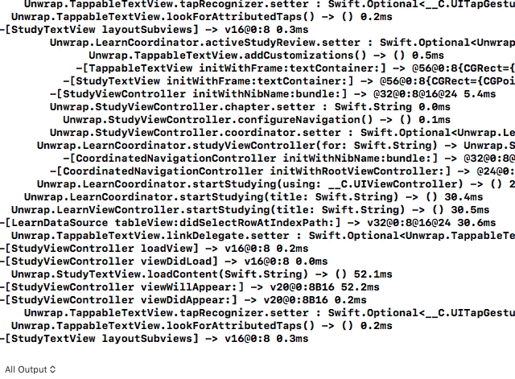

# SwiftTrace

Trace Swift and Objective-C method invocations of non-final classes in an app bundle or framework.
Think [Xtrace](https://github.com/johnno1962/Xtrace) but for Swift and Objective-C. You can also 
add "aspects" to member functions of non-final Swift classes to have a closure called before or after
a function implementation executes which in turn can modify incoming arguments or the return value!
Apart from the loggin functionality, with binary distribution of Swift frameworks on the horizon perhaps
this will be of use in the same way "Swizzling" was in days of yore.



Note: none of these features will work on a class or method that is final or internal in 
a module compiled with whole module optimisation as the dispatch of the method
will be "direct" i.e. linked to a symbol at the call site rather than going through the
class' vtable.

SwiftTrace is most easily used as a CocoaPod and can be added to your project by temporarily adding the
following line to it's Podfile:
```swift
    pod 'SwiftTrace'
 ```
This project has been updated to Swift 5 from Xcode 10.2.:
```swift
    pod 'SwiftTrace', '5.5.0'
 ```
Once the project has rebuilt, import SwiftTrace into the application's AppDelegate and add something like
the following to the beginning of it's didFinishLaunchingWithOptions method:
```swift
    SwiftTrace.traceBundle(containing: type(of: self))
 ```
This traces all classes defined in the main application bundle.
To trace, for example, all classes in the RxSwift Pod add the following
```swift
    SwiftTrace.traceBundle(containing: RxSwift.DisposeBase.self)
 ```
This gives output in the Xcode debug console such as that above.

To trace a system framework such as UIKit you can trace classes using a pattern:
```swift
    SwiftTrace.traceClassesMatching(pattern:"^UI")
 ```
Individual classes can be traced using the underlying api:
```swift
    SwiftTrace.trace(aClass: MyClass.self)
```
Output can be filtered using method name inclusion and exclusion regexps. 
```swift
    SwiftTrace.include(pattern: "TestClass")
    SwiftTrace.exclude(pattern: "\\.getter")
```
These methods must be called before you start the trace as they are applied during the "Swizzle" phase.
There is a default set of exclusions setup as a result of testing, tracing UIKit.
                      
    public let swiftTraceDefaultExclusions = "\\.getter|retain]|_tryRetain]|_isDeallocating]|^\\+\\[(Reader_Base64|UI(NibStringIDTable|NibDecoder|CollectionViewData|WebTouchEventsGestureRecognizer)) |^.\\[UIView |UIButton _defaultBackgroundImageForType:andState:|RxSwift.ScheduledDisposable.dispose"

If you want to further process output you can define a custom tracing class:
```swift
    class MyTracer: SwiftTrace.Patch {

        override func onEntry(stack: inout SwiftTrace.EntryStack) {
            print( ">> "+stack )
        }
    }
    
    SwiftTrace.patchFactory = MyTracer.self
 ```   
#### Aspects

You can add an aspect to a particular method using the method's de-mangled name:
```swift
    print(SwiftTrace.addAspect(aClass: TestClass.self,
                      methodName: "SwiftTwaceApp.TestClass.x() -> ()",
                      onEntry: { (_, _) in print("ONE") },
                      onExit: { (_, _) in print("TWO") }))
 ```   
This will print "ONE" when method "x" of TextClass is called and "TWO when it has exited. The
two arguments are the patch which is an object representing the "Swizzle" and the entry or 
exit stack. The full signature for the entry closure is:
```swift
       onEntry: { (patch: SwiftTrace.Patch, stack: inout SwiftTrace.EntryStack) in
 ```   
If you understand how registers are allocated to arguments it is possible to poke into the
stack to modify the incoming arguments and, for the exit aspect closure you can replace
the return value and on a good day prevent (and log) an error being thrown.

Replacing an input argument in the closure is relatively simple:
```swift
    stack.intArg1 = 99
    stack.floatArg3 = 77.3
 ```
Other types of argument a little more involved. They must be cast and String
takes up two integer registers.
```swift
    patch.rebind(&stack.intArg2).pointee = "Grief"
    patch.rebind(&stack.intArg4).pointee = TestClass()
 ```
In an exit aspect closure, setting the return type is easier as it is generic:
```swift
    stack.setReturn(value: "Phew")
 ```
When a function throws you can access NSError objects.
```swift
    print(patch.rebind(&stack.thrownError, to: NSError.self).pointee)
 ```
It is possible to set `stack.thrownError` to zero to cancel the throw but you will need to set
the return value.

#### Invocation interface

Now we have a trampoline infrastructure, it is possible to implement an invocation api for Swift:
```swift
    print("Result: "+SwiftTrace.invoke(target: b,
        methodName: "SwiftTwaceApp.TestClass.zzz(_: Swift.Int, f: Swift.Double, g: Swift.Float, h: Swift.String, f1: Swift.Double, g1: Swift.Float, h1: Swift.Double, f2: Swift.Double, g2: Swift.Float, h2: Swift.Double, e: Swift.Int, ff: Swift.Int, o: SwiftTwaceApp.TestClass) throws -> Swift.String",
        args: 777, 101.0, Float(102.0), "2-2", 103.0, Float(104.0), 105.0, 106.0, Float(107.0), 108.0, 888, 999, TestClass()))
 ```
In order to determine the mangled name of a method you can get the list for a class 
using this function:
```swift
    print(SwiftTrace.methodNames(ofClass: TestClass.self))
 ```
There are limitations to this abbreviated interface in that it only supports Double, Float,
String, Int, Object and CGRect arguments. For other struct types that do not contain
floating point values you can conform them to protocol `SwiftTraceArg` to be able to
pass them on the argument list. These values and return values must fit into 32 bytes
and not contain floats.

#### How it works
                      
A Swift `AnyClass` instance has a layout similar to an Objective-C class with some
additional data documented in the `ClassMetadataSwift` in SwiftTrace.swift. After this data
there is a vtable of pointers to the class and instance member functions of the class up to
the size of the class instance. SwiftTrace replaces these function pointers with a pointer
to a unique assembly language "trampoline" entry point which has destination function and
data pointers associated with it. Registers are saved and this function is called passing
the data pointer to log the method name. The method name is determined by de-mangling the
symbol name associated the function address of the implementing method. The registers are
then restored and control is passed to the original function implementing the method. 
 
Please file an issue if you encounter a project that doesn't work while tracing. It should
be 100% reliable as it uses assembly language trampolines rather than Swizzling like Xtrace.
Otherwise, the author can be contacted on Twitter [@Injection4Xcode](https://twitter.com/@Injection4Xcode). 
Thanks to Oliver Letterer for [imp_implementationForwardingToSelector](https://github.com/OliverLetterer/imp_implementationForwardingToSelector)
used to set up the trampolines. Thanks also  to [@twostraws](https://twitter.com/twostraws)'
[Unwrap](https://github.com/twostraws/Unwrap) and [@artsy](https://twitter.com/ArtsyOpenSource)'s
[eidolon](https://github.com/artsy/eidolon) used extensively during testing.

Enjoy!
